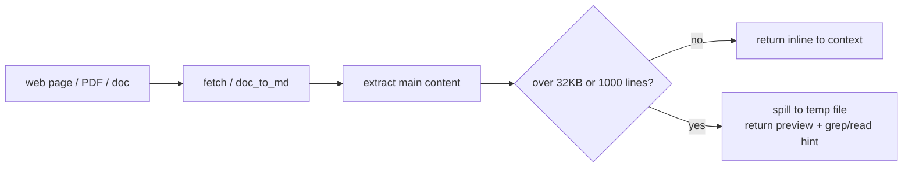

<p align="center">
  
</p>

# pi-quiver

[](https://buymeacoffee.com/jjurasszek)

Ground-truth ingestion for the [Pi coding agent](https://github.com/earendil-works/pi): pull real web pages, docs, and local files into context without flooding it.

## The problem

Reasoning from a model's training memory instead of the real page, the current docs, or the actual PDF is how agents confidently ship wrong answers about APIs that changed last month. Mature engineering work has to be data-driven - the agent needs to read the real source.

But the moment an agent does that, one `fetch` or PDF read can dump hundreds of kilobytes of boilerplate into context, degrading every turn after it.

## Why pi-quiver exists

`fetch` and `doc_to_md` bring real web pages, GitHub issues/PRs, and local PDF/DOCX/PPTX files into context - and every result is size-gated by construction: over 32 KB or 1000 lines spills to a temp file with a preview and a grep/read hint, so a single call can never flood the window. Ingestion is what makes data-driven work possible; the gate is what keeps it safe.

`session-name`, `sword-header`, `fast-mode`, and `provider-stall-watchdog` are opt-in ergonomics and recovery controls: session labeling, a themed startup header, Anthropic fast mode, and semantic-stall recovery.

## Part of the pi agent toolkit

Four independent extensions for the [pi coding agent](https://github.com/earendil-works/pi), each owning one concern of running agents seriously:

- **pi-quiver** - capabilities (fetch, doc conversion, session tools)
- [pi-cohort](https://github.com/jjuraszek/pi-cohort) - coordination (delegate to focused child agents)
- [pi-condense](https://github.com/jjuraszek/pi-condense) - context economy (prune context, keep it recoverable)
- [pi-gauntlet](https://github.com/jjuraszek/pi-gauntlet) - process (the gated brainstorm->ship workflow)

No code dependency between them. pi-quiver is call-level: it gates the size of what comes *in*. [pi-condense](https://github.com/jjuraszek/pi-condense) is loop-level: it prunes what's already *in context* once a tool call is done. Different problem, same discipline.

## Mental model

Every ingestion extension here is context-safe by construction, not by convention: the size check runs on every call, there's no flag to forget. `fetch` and `doc_to_md` bring real sources in; `session-name`, `sword-header`, `fast-mode`, and `provider-stall-watchdog` are opt-in.



## Quick example

```bash
pi install npm:pi-quiver
```

```
> fetch https://example.com/some-huge-changelog
Saved-To: /tmp/pi-fetch/2026-...-example.com-....md
60-line preview follows. grep '^#' the file for headings, or read a slice.
```

A 300 KB changelog page never touches your context window - you get a preview and a path.

## Architecture

| Extension | Tool | What it does |
| --- | --- | --- |
| `fetch.ts` | `fetch` | Retrieve URLs over HTTP(S). HTML -> Markdown (Readability extraction, Turndown conversion). Binary saved untouched to a temp file. GitHub issue/PR/repo/actions-run URLs auto-route through `gh` (falls back to HTTP). Same size gate as `doc_to_md`. |
| `doc_to_md.ts` | `doc_to_md` | Convert a local PDF/DOCX/PPTX to Markdown. High-fidelity via `pymupdf4llm` (run through `uv`); degraded pure-JS fallback (`unpdf`) when `uv`/Python is unavailable or conversion times out. DOCX/PPTX convert via LibreOffice first. |
| `session-name.ts` | `/session-name` | Manual + opt-in automatic session naming, with Ghostty tab rename. OFF by default. |
| `sword-header.ts` | `/builtin-header` | Themed ASCII startup header replacing pi's default logo. OFF by default. |
| `fast-mode.ts` | `/fast` | Inject Anthropic fast-mode (`speed: "fast"` + `anthropic-beta: fast-mode-2026-02-01`) into every Claude Opus 4.8 request, any thinking level. `--fast` flag + `/fast [on\|off\|status]`. OFF by default. |
| `provider-stall-watchdog.ts` | - | Opt-in semantic-silence watchdog for human interactive TUI runs. Warns after 2 minutes and recovers after 4 minutes; policy D offers each stall to Pi's retry loop until the stall retry budget (`maxStallRetries`, default = `retry.maxRetries`) is exhausted. OFF by default. |

Full routing rules, size-gate mechanics, and config: [doc/fetch.md](doc/fetch.md), [doc/doc-to-md.md](doc/doc-to-md.md).

## Key concepts

| Concept | Meaning |
| --- | --- |
| Size gate | Text/Markdown/JSON output over 32 KB or 1000 lines spills to a temp file with a 60-line preview instead of inlining. |
| Content routing | HTML -> Markdown, binary -> untouched file, GitHub URLs -> `gh` CLI, everything else -> the size gate. |
| Graceful degradation | Optional binaries (`gh`, `uv`, LibreOffice) are never hard install-time deps; each has a defined, documented fallback or failure mode. |
| Opt-in extensions | `session-name`, `sword-header`, `fast-mode`, and `provider-stall-watchdog` do nothing until explicitly enabled in `settings.json`. |
| Provider stall recovery | The watchdog detects missing parsed semantic progress, not network liveness. It is limited to confirmed human interactive TUI runs. |

## When to use

- An agent needs to reason from a real web page, GitHub issue/PR, or local PDF/DOCX/PPTX instead of memory.
- You want that ingestion to be safe by default, with no risk of a single call blowing the context budget.
- A human interactive Pi session needs an opt-in guard against providers that stop making semantic progress.

## When NOT to use

- You need a general-purpose web scraper (JS-rendered pages, pagination, auth flows) - `fetch` does plain HTTP + Readability extraction, nothing more.
- You need spreadsheet conversion - `doc_to_md` explicitly excludes spreadsheets (they paginate badly via PDF).
- You want automatic session naming, a custom header, fast mode, or stall recovery without opting in - all stay off until you flip the config.
- You need watchdog behavior in JSON, RPC, print, or subagent runs - activation excludes them by input origin and mode, not environment or session lineage.

## Install

Published to npm as the unscoped `pi-quiver` package.

**User scope** (all repos under your pi profile):

```bash
pi install npm:pi-quiver
```

**Project scope** (current repo only, committable via `.pi/settings.json`):

```bash
pi install -l npm:pi-quiver
```

**Try without installing**:

```bash
pi -e npm:pi-quiver
```

**From a local checkout** (for hacking on the extensions):

```bash
git clone git@github.com:jjuraszek/pi-quiver.git ~/repos/pi-quiver
pi -e ~/repos/pi-quiver/fetch.ts
```

## Prerequisites

The npm package's bundled JS deps install automatically on `pi install`. A few **runtime system binaries** are optional; each degrades gracefully when absent:

| Prerequisite | Needed by | If absent |
| --- | --- | --- |
| `gh` (GitHub CLI, installed + `gh auth login`) | `fetch` GitHub issue/PR/repo/actions-run routing | Falls back to an HTTP fetch of the rendered page (private repos hit a login wall). |
| `uv` (+ managed Python 3.14, fetched on first use) | `doc_to_md` high-fidelity PDF conversion | Degrades to the pure-JS `unpdf` fallback (no faithful tables/headings). |
| LibreOffice (`soffice` on `PATH`) | `doc_to_md` DOCX/PPTX conversion | Office inputs error (no JS fallback for office->PDF); PDFs unaffected. |

None is a hard install-time dependency of the package; they are tools you provide in the environment where pi runs.

### Opt-in extension config

These extensions are opt-in via `settings.json` (project `.pi/settings.json` overrides the global agent-dir layer):

```jsonc
{
  "sessionAutoName": { "enabled": false, "ghosttyTab": true }, // or boolean shorthand
  "swordHeader": false,                                        // or { "enabled": true }
  "fastMode": false,                                           // or { "enabled": true }
  "providerStallWatchdog": false                               // or { "enabled": true }
}
```

`sessionAutoName.enabled` makes one extra short LLM call per session (once, after the first turn) to title it; `false` (default) makes no model calls. `fastMode` only affects `claude-opus-4-8` requests on Anthropic's `anthropic-messages` API; enabling it opts into premium fast-mode pricing. `--fast` forces it on for one launch; `/fast on|off` toggles live. Proxy providers (opencode, cloudflare-ai-gateway) are excluded. `fastMode`'s header injection needs the `before_provider_headers` hook (pi bundling `@earendil-works/pi-coding-agent` >= 0.80.5); on older pi the beta header is silently not sent. See [doc/fetch.md](doc/fetch.md) and [doc/doc-to-md.md](doc/doc-to-md.md) for the ingestion tools' full reference; session-name/sword-header behavior above is complete.

Recommended explicit retry and watchdog settings:

```json
{
  "retry": {
    "enabled": true,
    "maxRetries": 3,
    "baseDelayMs": 2000
  },
  "providerStallWatchdog": {
    "enabled": true,
    "warningMs": 120000,
    "recoveryMs": 240000,
    "maxStallRetries": 3
  }
}
```

`providerStallWatchdog` is OFF by default and runs only for confirmed human interactive TUI runs. JSON, RPC, print, and subagent runs are excluded by activation, not environment or session lineage. Verified with Pi 0.80.10: each semantic stall is aborted and offered to Pi retry until `maxStallRetries` conversions are used; further stalls stop for manual resubmission. `maxStallRetries` defaults to the layered `retry.maxRetries` (Pi default 3); consecutive stall conversions consume Pi retry attempts without a success reset in between, so keep `maxStallRetries <= retry.maxRetries`. A successful assistant turn resets the stall counter (mirroring Pi's own retry counter). The silence warning and all watchdog notices render as main-window notifications, not the bottom status line. Automatic continuation needs enabled Pi retry with remaining capacity. Disabled, exhausted, or incompatible retry degrades to manual resubmission. Pending steering or follow-ups return to the editor and are excluded from automatic continuation. Invalid merged watchdog config fails closed.

## Development

Deps are peers (`@earendil-works/*`, `@sinclair/typebox`) plus the bundled
runtime deps; install them transiently and run the full check:

```bash
npm install
npm run test:all      # node --test *.test.ts  +  tsc --noEmit typecheck
```

`npm test` runs the unit tests alone; `npm run typecheck` runs the type pass.
Both run in CI on ubuntu + windows (`.github/workflows/test.yml`).

## How this fits the platform

pi-quiver is how ground truth gets into an agent's context - real pages, PDFs, docs, cleanly and safely. The other three then coordinate work over it ([pi-cohort](https://github.com/jjuraszek/pi-cohort)), prune it once it's stale ([pi-condense](https://github.com/jjuraszek/pi-condense)), and govern the process end to end ([pi-gauntlet](https://github.com/jjuraszek/pi-gauntlet)).

## Support

If this saves you time, consider [buying me a coffee](https://buymeacoffee.com/jjurasszek).

## Release

Published to npm by CI. Pushing a `vX.Y.Z` tag triggers
`.github/workflows/release.yml`, which gates on `tag == package.json`, runs
`npm run test:all`, and publishes with `npm publish --provenance --access
public` via OIDC trusted publishing. **Never run `npm publish` by hand.**

Cut a release with the helper script (also exposed as the `/release` prompt +
the `release` skill at `.agents/skills/release/`):

```bash
bash .agents/skills/release/scripts/release.sh propose      # suggest a level
bash .agents/skills/release/scripts/release.sh patch        # or minor / major
bash .agents/skills/release/scripts/release.sh --dry-run patch
```

It bumps `package.json`, commits `Release <version>`, runs the tests, creates
and pushes the `vX.Y.Z` tag, then monitors the publish. See
`.agents/skills/release/SKILL.md` for the full flow (`sync-presets` migrates
old git-tag pins to `npm:pi-quiver@<version>`).
