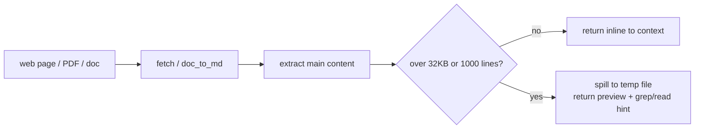

<p align="center">
  
</p>

# pi-quiver

[](https://buymeacoffee.com/jjurasszek)

Ground-truth ingestion for the [Pi coding agent](https://github.com/earendil-works/pi): pull real web pages, docs, and local files into context without flooding it.

## The problem

Reasoning from a model's training memory instead of the real page, the current docs, or the actual PDF is how agents confidently ship wrong answers about APIs that changed last month. Mature engineering work has to be data-driven - the agent needs to read the real source.

But the moment an agent does that, one `fetch` or PDF read can dump hundreds of kilobytes of boilerplate into context, degrading every turn after it.

## Why pi-quiver exists

`fetch` and `doc_to_md` bring real web pages, GitHub issues/PRs, and local PDF/DOCX/PPTX files into context - and every result is size-gated by construction: over 32 KB or 1000 lines spills to a temp file with a preview and a grep/read hint, so a single call can never flood the window. Ingestion is what makes data-driven work possible; the gate is what keeps it safe.

`session-name`, `sword-header`, `fast-mode`, and `provider-stall-watchdog` are opt-in ergonomics and recovery controls: session labeling, a themed startup header, Anthropic fast mode, and semantic-stall recovery.

## Part of the pi agent toolkit

Four independent extensions for the [pi coding agent](https://github.com/earendil-works/pi), each owning one concern of running agents seriously:

- **pi-quiver** - capabilities (fetch, doc conversion, session tools)
- [pi-cohort](https://github.com/jjuraszek/pi-cohort) - coordination (delegate to focused child agents)
- [pi-condense](https://github.com/jjuraszek/pi-condense) - context economy (prune context, keep it recoverable)
- [pi-gauntlet](https://github.com/jjuraszek/pi-gauntlet) - process (the gated brainstorm->ship workflow)

No code dependency between them. pi-quiver is call-level: it gates the size of what comes *in*. [pi-condense](https://github.com/jjuraszek/pi-condense) is loop-level: it prunes what's already *in context* once a tool call is done. Different problem, same discipline.

## Mental model

Every ingestion extension here is context-safe by construction, not by convention: the size check runs on every call, there's no flag to forget. `fetch` and `doc_to_md` bring real sources in; `session-name`, `sword-header`, `fast-mode`, and `provider-stall-watchdog` are opt-in.


```mermaid
flowchart LR
    S[web page / PDF / doc] --> T["fetch / doc_to_md"]
    T --> E[extract main content]
    E --> G{"over 32KB or 1000 lines?"}
    G -->|no| I[return inline to context]
    G -->|yes| F[spill to temp file<br/>return preview + grep/read hint]
```

## Quick example

```bash
pi install npm:pi-quiver
```

```
> fetch https://example.com/some-huge-changelog
Saved-To: /tmp/pi-fetch/2026-...-example.com-....md
60-line preview follows. grep '^#' the file for headings, or read a slice.
```

A 300 KB changelog page never touches your context window - you get a preview and a path.

## Architecture

| Extension | Tool | What it does |
| --- | --- | --- |
| `extensions/fetch.ts` | `fetch` | Retrieve URLs over HTTP(S). HTML -> Markdown (Readability extraction, Turndown conversion). Binary saved untouched to a temp file. GitHub issue/PR/repo/actions-run/actions-job URLs auto-route through `gh` (falls back to HTTP); failed runs/jobs include failed-step logs (best-effort, summary-only otherwise). Same size gate as `doc_to_md`. Behavior lives in `lib/fetch-core.ts`; also exposed as the `pi-quiver fetch` CLI (see [Claude Code support](#claude-code-support)). |
| `extensions/doc_to_md.ts` | `doc_to_md` | Convert a local PDF/DOCX/PPTX to Markdown. High-fidelity via `pymupdf4llm` (run through `uv`); degraded pure-JS fallback (`unpdf`) when `uv`/Python is unavailable or conversion times out. DOCX/PPTX convert via LibreOffice first. |
| `extensions/session-name.ts` | `/session-name` | Manual + opt-in automatic session naming, naming rules and deny list, long-session revisits, and Ghostty tab rename. OFF by default. |
| `extensions/sword-header.ts` | `/builtin-header` | Themed ASCII startup header replacing pi's default logo. OFF by default. |
| `extensions/fast-mode.ts` | `/fast` | Inject Anthropic fast-mode (`speed: "fast"` + `anthropic-beta: fast-mode-2026-02-01`) into every Claude Opus 4.8 / Opus 5 request, any thinking level. `--fast` flag + `/fast [on\|off\|status]`. OFF by default. |
| `extensions/provider-stall-watchdog.ts` | - | Opt-in provider-stall recovery, in two tiers: a pre-first-event deadline (`firstEventMs`, 20s) on every provider request in every mode, and the mid-stream pair (warn at 2 min, recover at 4 min) in TUI runs only. Policy D offers each stall to Pi's retry loop until the stall retry budget (`maxStallRetries`, default = `retry.maxRetries`) is exhausted. OFF by default. |

Full routing rules, size-gate mechanics, and config: [doc/fetch.md](doc/fetch.md), [doc/doc-to-md.md](doc/doc-to-md.md).

## Key concepts

| Concept | Meaning |
| --- | --- |
| Size gate | Text/Markdown/JSON output over 32 KB or 1000 lines spills to a temp file with a 60-line preview instead of inlining. |
| Content routing | HTML -> Markdown, binary -> untouched file, GitHub URLs -> `gh` CLI (failed runs/jobs get failed-step logs appended), everything else -> the size gate. |
| Graceful degradation | Optional binaries (`gh`, `uv`, LibreOffice) are never hard install-time deps; each has a defined, documented fallback or failure mode. |
| Opt-in extensions | `session-name`, `sword-header`, `fast-mode`, and `provider-stall-watchdog` do nothing until explicitly enabled in `settings.json`. |
| Provider stall recovery | The watchdog detects a missing first stream event and missing parsed semantic progress, not network liveness. The pre-first-event tier covers every mode and origin; the mid-stream tier is TUI-only. |

## When to use

- An agent needs to reason from a real web page, GitHub issue/PR, or local PDF/DOCX/PPTX instead of memory.
- You want that ingestion to be safe by default, with no risk of a single call blowing the context budget.
- A Pi run needs an opt-in guard against provider requests that never produce a first stream event, plus mid-stream silence recovery in interactive TUI sessions.

## When NOT to use

- You need a general-purpose web scraper (JS-rendered pages, pagination, auth flows) - `fetch` does plain HTTP + Readability extraction, nothing more.
- You need spreadsheet conversion - `doc_to_md` explicitly excludes spreadsheets (they paginate badly via PDF).
- You want automatic session naming, a custom header, fast mode, or stall recovery without opting in - all stay off until you flip the config.
- You need *mid-stream* stall recovery in JSON, RPC, or print runs - only the pre-first-event tier arms there; mid-stream silence falls through to pi's transport timeout.

## Install

Published to npm as the unscoped `pi-quiver` package.

**User scope** (all repos under your pi profile):

```bash
pi install npm:pi-quiver
```

**Project scope** (current repo only, committable via `.pi/settings.json`):

```bash
pi install -l npm:pi-quiver
```

**Try without installing**:

```bash
pi -e npm:pi-quiver
```

**From a local checkout** (for hacking on the extensions):

```bash
git clone git@github.com:jjuraszek/pi-quiver.git ~/repos/pi-quiver
pi -e ~/repos/pi-quiver/extensions/fetch.ts
```

## Prerequisites

The npm package's bundled JS deps install automatically on `pi install`. A few **runtime system binaries** are optional; each degrades gracefully when absent:

| Prerequisite | Needed by | If absent |
| --- | --- | --- |
| `gh` (GitHub CLI, installed + `gh auth login`) | `fetch` GitHub issue/PR/repo/actions-run/actions-job routing | Falls back to an HTTP fetch of the rendered page (private repos hit a login wall). |
| `uv` (+ managed Python 3.14, fetched on first use) | `doc_to_md` high-fidelity PDF conversion | Degrades to the pure-JS `unpdf` fallback (no faithful tables/headings). |
| LibreOffice (`soffice` on `PATH`) | `doc_to_md` DOCX/PPTX conversion | Office inputs error (no JS fallback for office->PDF); PDFs unaffected. |

None is a hard install-time dependency of the package; they are tools you provide in the environment where pi runs.

### Opt-in extension config

These extensions are opt-in via `settings.json` (project `.pi/settings.json` overrides the global agent-dir layer):

```jsonc
{
  "sessionAutoName": {
    "enabled": false,
    "ghosttyTab": true,
    "rules": [],
    "deny": [],
    "revisitFirstTurn": 0,
    "revisitEveryTurns": 0
  }, // or boolean shorthand
  "swordHeader": false, // or { "enabled": true }
  "fastMode": false,                                           // or { "enabled": true }
  "providerStallWatchdog": false                               // or { "enabled": true }
}
```

`sessionAutoName.enabled` makes one extra short LLM call per session (once, after the first turn) to title it; `false` (default) makes no model calls. `rules` appends house conventions to the naming prompt (later rules win when they conflict with the built-ins). Literal, case-insensitive `deny` phrases are stripped from every name; whitespace inside a phrase is loose, so `"acme corp"` also catches `AcmeCorp`. `revisitFirstTurn` re-evaluates the name once that many model round trips have completed, while `revisitEveryTurns` does so at every multiple; both default to `0` (off) because each revisit costs another short LLM call. For example, `10` and `100` mark round trips 10, 100, 200, 300. Revisits only run when the agent has fully settled (idle, nothing queued) - an automated multi-turn run such as a subagent chain is never renamed or delayed mid-flight; cadence points it crossed fire once, at the settle. A machine-generated name is replaced when stale. A name set by a human is never overwritten: the extension strongly prefers it, and announces a suggestion only when the work has clearly moved on. Counts come from the persisted transcript, so they survive resume.

`fastMode` only affects `claude-opus-4-8` and `claude-opus-5` requests on Anthropic's `anthropic-messages` API; enabling it opts into premium fast-mode pricing. `--fast` forces it on for one launch; `/fast on|off` toggles live. Proxy providers (opencode, cloudflare-ai-gateway) are excluded. `fastMode`'s header injection needs the `before_provider_headers` hook (pi bundling `@earendil-works/pi-coding-agent` >= 0.80.5); on older pi the beta header is silently not sent. See [doc/fetch.md](doc/fetch.md) and [doc/doc-to-md.md](doc/doc-to-md.md) for the ingestion tools' full reference; session-name/sword-header behavior above is complete.

`pi-ai` prices every fast request at standard rates - it has no `usage.speed` support and no request-level pricing modifier - so `fastMode` corrects the reported cost itself: a `message_end` handler scales all four `usage.cost` components by `FAST_MODE_COST_MULTIPLIER` (2x) and returns the corrected message. Persisted session JSONL and pi's own native cost display are always exact, since they're written from this corrected message. pi-cohort's live `Σ$` reflects the correction only when pi-quiver's `message_end` handler runs before pi-cohort's - best-effort, depending on extension load order - and is reconciled on pi-cohort's next `session_start` regardless. The upstream fix (teaching `pi-ai`'s `Usage`/`calculateCost` about `usage.speed`) is the better long-term path and is tracked separately.

Recommended explicit retry and watchdog settings:

```json
{
  "retry": {
    "enabled": true,
    "maxRetries": 3,
    "baseDelayMs": 2000
  },
  "providerStallWatchdog": {
    "enabled": true,
    "firstEventMs": 20000,
    "warningMs": 120000,
    "recoveryMs": 240000,
    "maxStallRetries": 3
  }
}
```

| Key | Default | Where it arms | What it measures |
| --- | --- | --- | --- |
| `enabled` | `false` | - | Master switch. OFF means the extension does nothing. |
| `firstEventMs` | `20000` | every provider request, every mode (`tui`/`print`/`json`/`rpc`), every origin | Silence between the request and the first assistant `message_start`. |
| `warningMs` | `120000` | mid-stream, `ctx.mode === "tui"` only | Silence since the last non-empty text/thinking/toolcall delta; notifies. |
| `recoveryMs` | `240000` | mid-stream, `ctx.mode === "tui"` only | Same clock; aborts and converts. Must be `> warningMs`. |
| `maxStallRetries` | layered `retry.maxRetries`, else `3` | shared by both tiers | Watchdog aborts that may convert to a retryable error before stopping. |

`providerStallWatchdog` is OFF by default. Once enabled it arms in two tiers per provider request:

- **Pre-first-event (`firstEventMs`).** Armed at every provider request, in every mode and from every origin - including extension-triggered turns that never emit `before_agent_start` - and cleared by the first assistant `message_start`. On expiry the request is aborted and, budget permitting, converted to a retryable error, so an unresponsive request recovers in ~22s (20s detection + Pi's 2s backoff) instead of the ~240s it took when only the mid-stream tier existed.
- **Mid-stream (`warningMs` / `recoveryMs`).** Armed from the first assistant `message_start` onward, and only when `ctx.mode === "tui"`. Aborting mid-generation discards billed output tokens and an unattended run has nobody to read the warning, so headless mid-stream silence deliberately falls through to the transport timeout instead.

**Raise `firstEventMs` if your provider is legitimately slow to first event.** Queueing gateways, throttled endpoints, and busy single-slot local model servers can hold the connection for well over 20s before their first stream event; every false abort re-uploads the whole context and spends one stall retry.

**Leave pi's own `httpIdleTimeoutMs` (default `300000`) at its default.** It is the transport backstop, and a single value drives undici's `headersTimeout` *and* `bodyTimeout` - lowering it to get fast pre-stream failure also truncates legitimate mid-stream gaps. `firstEventMs` is the knob for pre-stream silence.

Verified with Pi 0.80.10: each stall is aborted and offered to Pi retry until `maxStallRetries` conversions are used; further stalls stop for manual resubmission. Both tiers draw on that one budget. `maxStallRetries` defaults to the layered `retry.maxRetries` (Pi default 3, an explicit `0` honoured); `0` is valid and means "detect and stop, never auto-retry". Consecutive stall conversions consume Pi retry attempts without a success reset in between, so keep `maxStallRetries <= retry.maxRetries`. A successful assistant turn resets the stall counter (mirroring Pi's own retry counter). Automatic continuation needs enabled Pi retry with remaining capacity. Disabled, exhausted, or incompatible retry degrades to manual resubmission. Pending steering or follow-ups return to the editor and are excluded from automatic continuation. Invalid merged watchdog config fails closed.

Operational notes:

- **Settings are read once per session,** on the first provider request. Editing `settings.json` mid-session changes nothing until you restart the session - that includes repairing an invalid block that already disabled the extension.
- **A watchdog abort that the provider ignores escalates after a fixed 10s.** Any post-abort stream event re-arms that deadline (bytes prove only that the connection was alive at that instant), so a stream that emits a straggler and then wedges still escalates 10s after its last event. This reduces the hang; it cannot force the provider to stop, and undici's timeouts remain the final backstop.
- **Headless runs report on stderr.** In `print`/`json` mode pi binds a no-op UI, so watchdog notices go out via `console.warn`. Nothing is ever written to stdout, which `json` mode uses for its protocol. In TUI and RPC the notices render as main-window notifications, not the bottom status line.

## Claude Code support

`fetch`'s core (`lib/fetch-core.ts`) is also published as a CLI, so Claude Code can use the same routing, size gate, and spill behavior as pi's native tool - without pi ever seeing Claude-only files.

**Exposed:** the `quiver` plugin, served from this repo's `.claude-plugin/marketplace.json`, with one skill: `fetch` (invoked as `quiver:fetch` / `/quiver:fetch`). The skill runs `npx -y pi-quiver@latest fetch <url> [flags]` via Bash - full parameter parity with the pi tool (`--method`, `--header`, `--body`, `--raw`, `--timeout-ms`), same GitHub `gh` routing (including failed-step logs on failed runs/jobs), same size gate, same binary-to-temp-file handling. See [doc/fetch.md](doc/fetch.md#claude-code-cli-pi-quiver-fetch) for exit codes and flags.

**Not exposed:** pi extensions, `doc_to_md`, and everything else in this package - the marketplace allowlists only `./skills/fetch`, and the npm tarball never ships `skills/` or `.claude-plugin/` (pi's own `files` allowlist excludes them, and pi's explicit `pi.extensions` manifest makes them invisible to pi's convention-directory auto-discovery either way).

Add the marketplace and enable the plugin in `.claude/settings.json`:

```json
{
	"extraKnownMarketplaces": {
		"pi-quiver": { "source": { "source": "github", "repo": "jjuraszek/pi-quiver" } }
	},
	"enabledPlugins": { "quiver@pi-quiver": true }
}
```

Activates on folder trust.

**Release sequencing:** the skill goes live only with (or after) the npm release that ships the `pi-quiver` bin - until that tag is on npm, `npx -y pi-quiver@latest fetch` resolves a bin-less package and fails.

## Development

Deps are peers (`@earendil-works/*`, `@sinclair/typebox`) plus the bundled
runtime deps; install them transiently and run the full check:

```bash
npm install
npm run test:all      # node --test test/*.test.ts  +  tsc --noEmit typecheck
```

`npm test` runs the unit tests alone; `npm run typecheck` runs the type pass.
Both run in CI on ubuntu + windows (`.github/workflows/test.yml`).

## How this fits the platform

pi-quiver is how ground truth gets into an agent's context - real pages, PDFs, docs, cleanly and safely. The other three then coordinate work over it ([pi-cohort](https://github.com/jjuraszek/pi-cohort)), prune it once it's stale ([pi-condense](https://github.com/jjuraszek/pi-condense)), and govern the process end to end ([pi-gauntlet](https://github.com/jjuraszek/pi-gauntlet)).

## Contributing

See [CONTRIBUTING.md](CONTRIBUTING.md) - issues follow a Context / Problem / Idea / Acceptance Criteria template; PRs run the [pi-gauntlet](https://github.com/jjuraszek/pi-gauntlet) workflow (one-liners exempt from ceremony, never from keeping docs truthful).

## Support

If this saves you time, consider [buying me a coffee](https://buymeacoffee.com/jjurasszek).

## Release

Published to npm by CI. Pushing a `vX.Y.Z` tag triggers
`.github/workflows/release.yml`, which gates on `tag == package.json`, runs
`npm run test:all`, and publishes with `npm publish --provenance --access
public` via OIDC trusted publishing. **Never run `npm publish` by hand.**

Cut a release with the helper script (also exposed as the `/release` prompt +
the `release` skill at `.agents/skills/release/`):

```bash
bash .agents/skills/release/scripts/release.sh propose      # suggest a level
bash .agents/skills/release/scripts/release.sh patch        # or minor / major
bash .agents/skills/release/scripts/release.sh --dry-run patch
```

It bumps `package.json`, commits `Release <version>`, runs the tests, creates
and pushes the `vX.Y.Z` tag, then monitors the publish. See
`.agents/skills/release/SKILL.md` for the full flow (`sync-presets` migrates
old git-tag pins to `npm:pi-quiver@<version>`).
